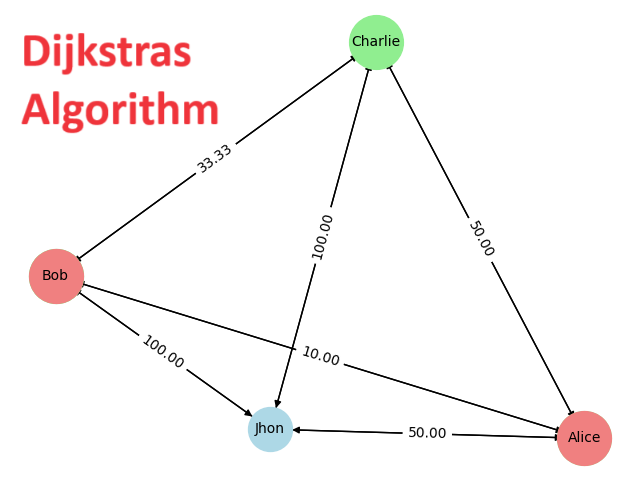

# Install project

```sh
poetry install
```

# Run Algorithm

```sh
poetry run python ./social.py
```

To find the shortest path between Alice and David.

</img>

Next exercise proposition:

- Imagine every person starts with a distance of 100 between them.
- Every time that a person share somethin with anyone, the distance between them is reduced by:
    distance = 100/(N+1)

    Where N = number of time that the user has share something with that user.

- If distance between 2 users that never shared directly, is less or equal than 40, that user should appears as suggestion.
- If distance between 2 users that never shared directly, is less or equal than 10, that user should appear as recommendation as friend.

Solution for the exercise:

```sh
poetry run python ./exercise.py
```

</img>